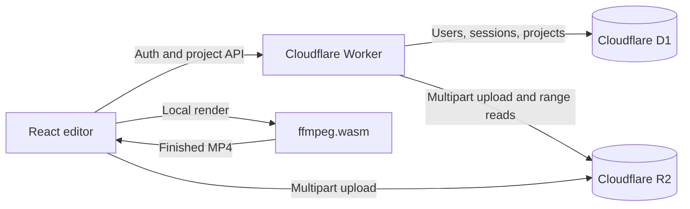

# Framecut

Framecut is a focused, full-stack browser video editor for stop-motion animation, compression, resizing, and cropping. It has an interactive thumbnail timeline, private accounts, persistent projects, multipart media uploads, and downloadable MP4 exports.

The application runs on Cloudflare Workers, stores relational data in D1, stores source videos and exports in R2, and performs video rendering on the user's device with ffmpeg.wasm.

> Sponsored by **Autter**.

## Features

- Email and password signup and sign-in with Better Auth
- Private, user-owned projects
- Source-video uploads to private R2 storage
- Multipart uploads in 8 MiB parts for large files
- Authenticated byte-range streaming for smooth seeking
- Visual thumbnail timeline with playhead, zoom, and draggable trim handles
- Stop-motion frame-rate control from 1 to 24 fps, with a 4 fps default
- Free crop controls plus 16:9, 9:16, 1:1, and 4:5 presets
- Source, 1080p, 720p, square, vertical, and custom resize options
- Adjustable MP4 compression
- In-browser H.264/AAC rendering and upload of finished exports to R2
- Dark and light themes, responsive layouts, and keyboard-accessible controls
- Project autosave and deletion, including associated R2 media cleanup

## Architecture



Rendering runs in the browser so the Worker does not need a native FFmpeg process or a separate render server. The Worker remains responsible for authentication, authorization, metadata, upload coordination, and private media delivery.

## Stack

- React 19, TypeScript, and Vite
- Cloudflare Workers with the Cloudflare Vite plugin
- Cloudflare D1 and R2
- Better Auth with its native D1 adapter
- ffmpeg.wasm
- Zod, Phosphor Icons, Oxlint, and Vitest

## Requirements

- Node.js 20 or newer
- npm
- A Cloudflare account with Workers, D1, and R2 access
- Wrangler authentication for deployment

## Local development

1. Clone and install dependencies.

   ```bash
   git clone https://github.com/sagnik11/autter-video-editor.git
   cd autter-video-editor
   npm install
   ```

2. Create the local secret file.

   ```bash
   cp .dev.vars.example .dev.vars
   openssl rand -base64 32
   ```

   Paste the generated value into `BETTER_AUTH_SECRET` in `.dev.vars`. Keep this file private.

3. Generate Cloudflare binding types and initialize the local D1 database.

   ```bash
   npm run cf-typegen
   npx wrangler d1 migrations apply autter-video-editor-db --local
   npm run seed:ffmpeg:local
   ```

4. Start the application.

   ```bash
   npm run dev
   ```

   Vite prints the local URL. The Cloudflare Vite plugin supplies local D1 and R2 emulation.

## Cloudflare deployment

The binding declarations in `wrangler.jsonc` use Cloudflare's automatic provisioning. The first deployment is a bootstrap deployment that creates the D1 database and R2 bucket named in the configuration. Framecut stores the 31 MiB ffmpeg WebAssembly binary in R2 because it is larger than Cloudflare's per-file static asset limit.

```bash
npx wrangler login
npm run deploy
npx wrangler d1 migrations apply autter-video-editor-db --remote
npm run seed:ffmpeg
npx wrangler secret put BETTER_AUTH_SECRET
npm run deploy
```

Use a unique, randomly generated production secret of at least 32 characters. The second deployment starts the application after the schema and secret are ready. If your account or CI flow does not use automatic provisioning, create the D1 database and R2 bucket with Wrangler first, then add the returned D1 `database_id` to `wrangler.jsonc`.

For CI, authenticate Wrangler with scoped Cloudflare credentials and store `BETTER_AUTH_SECRET` in Cloudflare, not in the repository. Run remote migrations before promoting a release that changes the schema.

## Data model

The migration at `migrations/0001_initial.sql` creates Better Auth's `user`, `session`, `account`, and `verification` tables plus the application `project` table. A project records:

- ownership and project status
- private R2 keys for its source and latest export
- source filename, MIME type, size, duration, and dimensions
- JSON editor settings
- creation and update timestamps

R2 objects use this layout:

```text
<user-id>/<project-id>/source/<random-id>.<ext>
<user-id>/<project-id>/export/<random-id>.<ext>
```

Every project and media request verifies the active user's ownership. The R2 bucket is not public.

## Rendering pipeline

1. The editor downloads the authenticated source through the Worker's range-capable media route.
2. ffmpeg.wasm loads as a lazy client asset only when a render starts.
3. The command builder applies trim, crop, resize/pad, stop-motion cadence, and H.264 compression in a single render.
4. The resulting MP4 is exposed as a local download and uploaded to the project's private R2 export key.

Stop motion is produced by sampling at the selected cadence and holding each sampled frame through a 30 fps output stream. Audio is retained when present. Crop values are normalized in the UI and converted to even pixel dimensions for encoder compatibility.

## Commands

| Command | Purpose |
| --- | --- |
| `npm run dev` | Start React and the local Worker runtime |
| `npm run build` | Type-check and create production bundles |
| `npm run seed:ffmpeg:local` | Seed the ffmpeg WebAssembly core into local R2 |
| `npm run seed:ffmpeg` | Seed the ffmpeg WebAssembly core into production R2 |
| `npm run lint` | Run Oxlint with warnings denied |
| `npm test` | Run command-builder tests |
| `npm run check` | Generate bindings, lint, test, and build |
| `npm run deploy:dry` | Build and validate a Wrangler deployment without publishing |
| `npm run deploy` | Build and deploy to Cloudflare |

## Project structure

```text
src/components/         React pages and editor controls
src/lib/                API client, renderer, media commands, and video helpers
worker/                 Worker entrypoint, Better Auth, and project/media API
migrations/             D1 schema migrations
static/                 Static application assets
wrangler.jsonc          Worker, D1, R2, and observability configuration
ROADMAP.md              Issue-sized community work beyond the core scope
CONTRIBUTING.md         Contribution workflow and engineering constraints
```

## Privacy and security notes

- Video processing happens locally in the user's browser; only the source and finished export are stored in R2.
- Sessions use HTTP-only Better Auth cookies, secure cookies in HTTPS, and a five-minute cookie cache.
- API responses containing account or project data use `Cache-Control: no-store`.
- Upload keys include both the authenticated user and owned project, and keys are validated before multipart operations.
- The starter configuration accepts uploads up to 2 GiB. Adjust `MAX_UPLOAD_BYTES` only after reviewing browser memory, R2 multipart, and product quota constraints.

This is a production-oriented starter, not a security certification. Before a public launch, add email verification, password-reset delivery, abuse controls, rate limits, a privacy policy, and retention rules appropriate to your users.

## Browser and performance notes

The ffmpeg.wasm core adds an approximately 31 MiB lazy download served from R2 and cached immutably by the browser. Rendering speed and maximum practical video size depend on the user's browser, memory, and CPU. Modern desktop Chromium, Firefox, and Safari are the primary targets. Keep the tab open while exporting.

For large production workloads or mobile-first rendering, consider a future server-side job path while retaining the current local renderer for privacy and low operating cost.

## Troubleshooting

- **`BETTER_AUTH_SECRET must be configured`**: add a 32-character or longer secret to `.dev.vars` locally or Cloudflare secrets in production.
- **Missing D1 tables**: run the appropriate local or remote `wrangler d1 migrations apply` command.
- **R2 upload fails locally**: restart `npm run dev` after changing bindings and confirm `.wrangler` is writable.
- **Export reports that the video engine is not seeded**: run `npm run seed:ffmpeg:local` locally or `npm run seed:ffmpeg` for the remote bucket.
- **Export is slow or the tab runs out of memory**: shorten the trim range, reduce output dimensions, increase compression, or use a desktop browser with more available memory.
- **Video seeking fails after reload**: inspect the authenticated `/api/projects/:id/media/source` request and verify that the response includes range headers.

## Contributing

Core scope intentionally stays limited to stop motion, trim, crop, resize, compression, and export. See [ROADMAP.md](ROADMAP.md) for well-bounded extensions and [CONTRIBUTING.md](CONTRIBUTING.md) for the development workflow.

## License

MIT. See [LICENSE](LICENSE).

## Sponsorship

Framecut is sponsored by **Autter**. Please retain the unobtrusive sponsorship credit when redistributing the hosted product.
